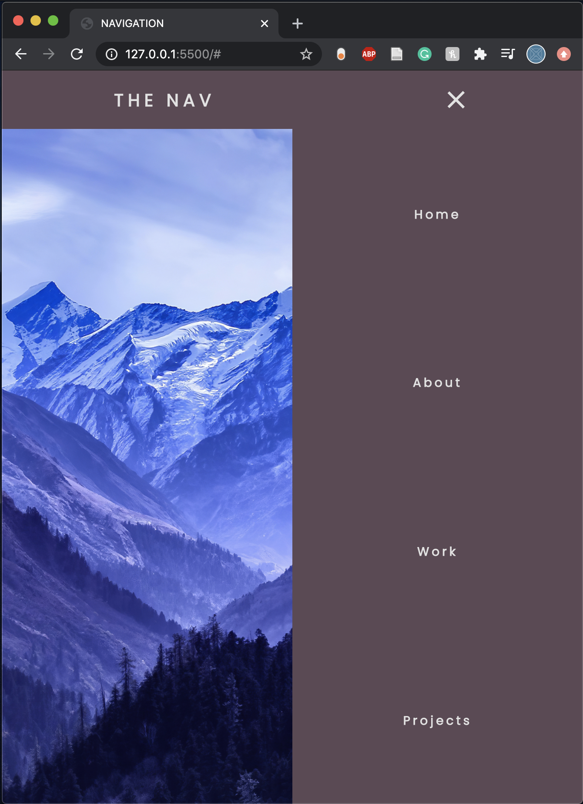

# Responsive Navbar
I followed a tutorial to create a responsive navbar using basic HTML, CSS, and Javascript. To run, clone the repository and open `index.html` in your preferred browser. As you resize the window to a phone screen, the navigation pages automatically hide behind a menu button. Links to tutorial and image are below.

## Navbar with Computer Width
  

## Navbar with Phone Width

Tutorial Link: https://www.youtube.com/watch?v=gXkqy0b4M5g  
Image Link: https://hdqwalls.com/snowy-blue-mountains-4k-wallpaper
